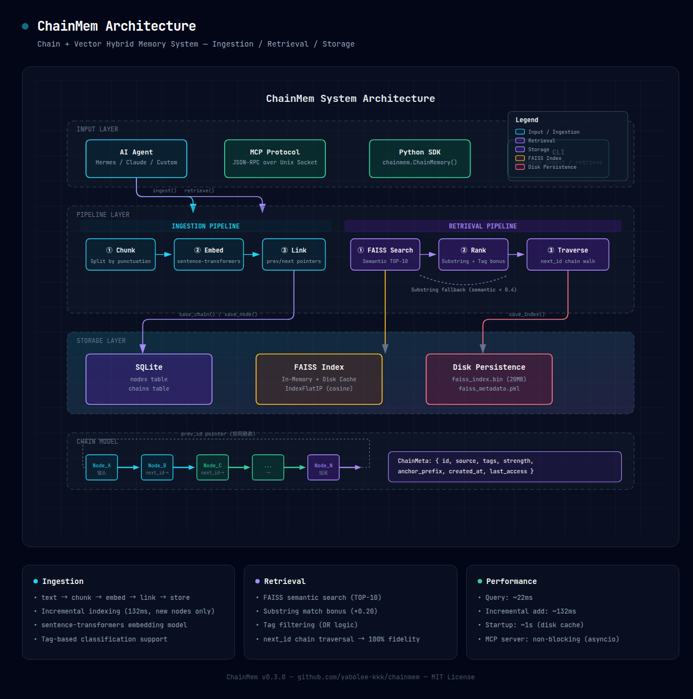

<p align="center">
  
</p>

<p align="center">
  
  
  
  
  
  
</p>

<h1 align="center">🧵 ChainMem（链忆）</h1>
<p align="center"><b>链式 + 向量混合记忆系统 — 让 AI 拥有像人一样的联想式回忆</b></p>

<p align="center">
  <i>你给它一个"线头"，它还你一件"毛衣"。</i>
</p>

<p align="center">
  🌐 <a href="README.en.md">English</a> · 中文
</p>

---

## 🧠 为什么需要 ChainMem？

### 人的记忆是什么样？

> 你听到一首歌的前奏 → 想起整首歌 → 想起那个夏天 → 想起那个人...

人的记忆是**链式的**——一个线索能引出整段完整的记忆。你不需要"搜索"过去，你只需要一个**线头**。

### AI 的记忆是什么样？

现有的 AI 记忆系统（向量数据库）本质上是**图书馆模式**：

```
你搜"股票" → 返回 10 个孤立片段：
  [片段A] "...股票..."
  [片段B] "...股票投资..."
  [片段C] "...关于股票..."
  ...
  但凑不出"当时到底说了什么"
```

每条记忆是独立的**点**——能搜到碎片，但**凑不出一段完整的、前后连贯的记忆**。

### ChainMem 的答案

ChainMem 用**链式结构**模拟人脑的联想回忆：

```
你搜"股票" → 找到链头 → 沿指针遍历 → 整段对话一字不差重现：
  "其实我的想法是股票投资..."
  "应该分散风险"
  "所以我选了消费、科技、医疗三个板块..."
  "每个板块配比大约是..."
```

**不是搜索碎片，而是还原整段记忆。**

---

## ✨ 核心特性

| 特性 | 说明 |
|------|------|
| 🧵 **链式记忆** | 双向指针串联，线头一扯整件毛衣出来 |
| 🔍 **语义搜索** | FAISS 向量检索兜底，记不清原话也能搜到 |
| 🎯 **子串匹配** | 短查询也能精确命中 |
| ⚡ **毫秒级响应** | 查询 ~22ms，增量添加 ~132ms |
| 🚀 **秒级启动** | FAISS 索引持久化，重启从 60s → 1s |
| 🏷️ **标签分类** | 按项目/主题组织记忆 |
| 🔌 **MCP 协议** | 支持 HTTP + Unix Socket 双传输，原生集成 Hermes Agent 等 AI Agent（[配置指南](docs/mcp-integration.md)） |
| 🖥️ **Web 仪表盘** | 内置管理界面 `http://127.0.0.1:3115/`，可视化浏览、搜索、新建记忆 |
| 🐍 **Python SDK** | 一句话集成到你的项目 |

---

## ⚡ 快速开始

### 安装

ChainMem 采用**分层依赖**设计，你可以按需选择安装方式：

| 安装方式 | 命令 | 大小 | 功能 |
|:--------|:-----|:---|:-----|
| 🪶 **核心** | `pip install chainmem` | ~22 KB | CLI + Python SDK（不含 sentence-transformers） |
| 🔍 **完整** | `pip install chainmem[full]` | ~1.5~2 GB | 语义搜索 + FAISS 索引 |
| 🔐 **加密** | `pip install chainmem[secure]` | ~5 MB | 自动检测凭证 + Fernet 加密存储 |
| 🚀 **完整+加密** | `pip install chainmem[full,secure]` | ~1.5~2 GB | 全部功能 |
| 🐍 **源码** | `git clone ... && pip install -e .` | ~20 KB + 自装依赖 | 根据需求自行安装 |

> **💡 建议：** 先装核心版感受一下，需要语义搜索时再装完整版。
>
> **💡 网络不好？** `pip install chainmem[full]` 默认拉 CUDA torch（~1GB），建议改用：
> ```bash
> pip install chainmem
> pip install torch --index-url https://download.pytorch.org/whl/cpu    # CPU 版 ~192MB
> pip install sentence-transformers faiss-cpu
> ```

#### 🪶 核心版安装（推荐首次尝试）

```bash
pip install chainmem
```

几秒就下完。此版本支持：
- CLI 全功能（ingest / retrieve / stats / serve）
- SQLite 持久化
- FTS5 文本搜索
- MCP 服务器
- **语义搜索需要额外安装依赖（见下文）**

#### 🔥 完整版（启用语义搜索）

```bash
pip install chainmem[full]
```

自动安装 sentence-transformers 和 faiss-cpu。下载较大（~1.5~2 GB），但带来：
- FAISS 向量语义搜索
- 高精度混合检索（语义 + 子串 + 标签）

#### 📦 手动安装依赖

如果网络不稳定或想自己控制版本，可以逐个安装：

```bash
# 安装 ChainMem 核心
pip install chainmem

# CPU 版 torch（推荐，网络慢时避免下载 ~1GB CUDA 依赖）
pip install torch --index-url https://download.pytorch.org/whl/cpu

# 手动安装语义搜索依赖
pip install sentence-transformers>=3.0
pip install faiss-cpu>=1.8
```

依赖下载地址（可自行下载 whl 后离线安装）：

| 依赖 | PyPI 地址 | 说明 |
|:-----|:----------|:-----|
| sentence-transformers | https://pypi.org/project/sentence-transformers/ | 文本嵌入模型（~500 MB） |
| faiss-cpu | https://pypi.org/project/faiss-cpu/ | 向量相似度搜索（~30 MB） |
| transformers | https://pypi.org/project/transformers/ | 嵌入模型的子依赖（~300 MB） |
| torch | https://pypi.org/project/torch/ | transformers 的子依赖（~800 MB） |

```bash
# 示例：离线安装（先下载 whl 文件）
pip install sentence_transformers-3.x.x-py3-none-any.whl
pip install faiss_cpu-1.x.x-cp311-cp311-manylinux_2_17_x86_64.whl
```

> **注意：** 如果只安装核心版，调用 `ingest()` 或 `retrieve()` 时会提示安装完整版。不影响 CLI 基本操作和 MCP 服务器启动。
>
> **🌐 HuggingFace 国内镜像：** 如果服务器无法连接 huggingface.co，模型下载会失败。设置环境变量使用国内镜像：
> ```bash
> export HF_ENDPOINT=https://hf-mirror.com
> # 然后运行 chainmem
> ```
> 也可在 systemd service 或 Hermes config 的 `env` 字段中声明此变量（详见 [MCP 集成指南](docs/mcp-integration.md)）。

### Python SDK

```python
from chainmem import ChainMemory

# 初始化
cm = ChainMemory(db_path="~/.chainmem/data.db").open()

# 结链：把一段对话存为记忆
chain = cm.ingest(
    "其实我的想法是把每一次的记忆包括一次对话全部变成一个链条",
    source="demo",
    tags=["讨论", "记忆系统", "架构"],
)
print(f"链 ID: {chain.id}, 节点数: {chain.node_count}")

# 追溯：输入几个字，拉出整段记忆
result = cm.retrieve("其实我的想法")
print("".join(result))  # → 完整记忆复原

# 统计
print(cm.stats())

cm.close()
```

### CLI 模式

```bash
# 结链
chainmem ingest "其实我的想法是把每一次的记忆包括一次对话全部变成一个链条" --source demo --tags 讨论,记忆系统

# 追溯
chainmem retrieve "其实我的想法"

# 统计
chainmem stats

# 启动 MCP 服务器（用于 AI Agent 集成）
# HTTP 模式（推荐 — 持久连接，网关重启不受影响）
chainmem serve --socket /tmp/chainmem.sock --http-port 3115

# Unix Socket 模式（兼容旧版）
chainmem serve --socket /tmp/chainmem.sock
```

---

## 🔬 工作原理

### 结链（Ingestion）



```
  原始文本
      │
      ▼
  ┌─────────────┐
  │  语义切块     │  按标点/语义切成短语块（6-18字）
  └──────┬──────┘
         │
         ▼
  ┌─────────────┐
  │  向量嵌入     │  sentence-transformers 编码
  └──────┬──────┘
         │
         ▼
  ┌─────────────┐     ┌──────────────────┐
  │  链式串联     │────▶│  Node_A → Node_B │
  │  prev/next   │     │      → Node_C    │
  │  双向指针     │     └──────────────────┘
  └──────┬──────┘
         │
         ▼
  ┌─────────────┐
  │  SQLite 存储  │  零依赖持久化
  └─────────────┘
```

### 追溯（Retrieval）

```
  用户查询（"股票"）
      │
      ▼
  ┌─────────────┐     ┌──────────────────┐
  │  FAISS 语义   │     │  子串精确匹配      │
  │  搜索 (TOP10) │────▶│  +0.20 加分       │
  └──────┬──────┘     └──────────────────┘
         │
         ▼
  ┌─────────────┐
  │  候选排序     │  语义分 + 子串分 + 标签分
  └──────┬──────┘
         │
         ▼
  ┌─────────────┐     ┌──────────────────┐
  │  指针链遍历    │────▶│  Node_A → Node_B │
  │  next_id     │     │      → Node_C    │
  │  忠实还原     │     │  → 完整对话输出    │
  └─────────────┘     └──────────────────┘
```

---

## 📊 性能对比

| 指标 | 传统向量搜索 | ChainMem |
|:-----|:----------:|:--------:|
| **检索速度** | ~50ms | **~22ms** |
| **结果完整性** | 碎片 | **100% 原始记忆** |
| **启动时间** | ~60s（全量重建） | **~1s**（磁盘加载） |
| **增量添加** | 全量重建 | **~132ms**（仅编新节点） |
| **中文支持** | 一般 | **优秀**（trigram FTS5） |
| **检索精度** | 语义近似 | **语义 + 子串 + 标签** 混合 |

---

## 🔧 与 AI Agent 集成

### Hermes Agent（MCP 协议）

**推荐方式 — HTTP 传输（持久连接，网关重启不受影响）：**

```yaml
mcp_servers:
  chainmem:
    url: http://127.0.0.1:3115/mcp
    transport: http
```

> 前提：ChainMem 服务以 HTTP 模式运行：`chainmem serve --socket /tmp/chainmem.sock --http-port 3115`

**兼容方式 — Unix Socket：**

```yaml
mcp_servers:
  chainmem:
    command: chainmem
    args: ["serve", "--socket", "/tmp/chainmem.sock"]
```

启动后，Hermes 自动获得三个工具：

| 工具 | 功能 |
|:-----|:-----|
| `chainmem_ingest(text, source, tags)` | 结链：存储记忆 |
| `chainmem_retrieve(query, tags)` | 追溯：检索记忆（支持标签过滤） |
| `chainmem_stats()` | 统计：查看记忆库状态 |

---

## 🖥️ Web 仪表盘

ChainMem 服务内置 Web 管理界面。服务运行后（`chainmem serve --http-port 3115` 或使用持久化脚本），在浏览器打开：

```
http://127.0.0.1:3115/
```

### 功能

| 功能 | 说明 |
|:-----|:-----|
| 📊 **统计栏** | 记忆链数、节点总数、标签数实时显示 |
| 📋 **链列表** | 按时间倒序，显示前缀、节点数、标签、内容预览 |
| 🔍 **搜索** | 关键词 + 标签过滤，点击结果查看完整链 |
| ⛓️ **详情** | 单条记忆链完整内容，含所有节点原文 |
| ✏️ **新建记忆** | 直接输入文本、来源、标签，即时存储 |

### API 端点

Web 仪表盘基于以下 REST API：

| 端点 | 方法 | 说明 |
|:-----|:----|:-----|
| `/health` | GET | 健康检查 + 统计 |
| `/api/chains` | GET | 列出所有记忆链（含预览） |
| `/api/chain/{id}` | GET | 获取单链完整内容 |
| `/api/search` | POST | 语义搜索记忆 |
| `/api/ingest` | POST | 新建记忆 |

所有端点支持 CORS，可直接从前端调用。

---

## 🗺️ 路线图

```
Phase 1 ✅ 核心闭环
  ├─ 结链（文本 → 切块 → 嵌入 → 存储）
  ├─ 追溯（语义搜索 + 子串匹配 + 指针遍历）
  ├─ MCP 服务器持久化（HTTP + Unix Socket 双传输）
  ├─ FAISS 索引持久化（秒级启动）
  └─ 增量索引（毫秒级添加）

Phase 2 🏗️ 类人记忆机制
  ├─ 衰减曲线（Forgetting Curve）
  ├─ 联想增强（检索A时推荐相关链）
  ├─ 自动结链（对话中自动记忆）
  └─ 分支消歧（相同前缀不同下文）

Phase 3 🎯 真正的"人脑记忆"
  ├─ 分层记忆（工作记忆 + 短期 + 长期）
  ├─ 记忆整合（多条记忆→知识归纳）
  ├─ 跨 Agent 记忆共享
  └─ 睡眠压缩（像人脑睡觉时整理记忆）
```

---

## 🤝 如何贡献

我们欢迎所有形式的贡献！详细指南请参见 [CONTRIBUTING.md](CONTRIBUTING.md)。

**新手友好任务：**
- 📖 完善文档和示例
- 🐛 修复 Bug
- ✅ 增加测试覆盖
- 🌍 国际化（i18n）
- 💡 提出新功能建议

---

## 📦 项目结构

```
chainmem/
├── pyproject.toml           # 项目配置
├── README.md                # 本文件
├── LICENSE                  # MIT License
├── CONTRIBUTING.md          # 贡献指南
├── src/chainmem/
│   ├── __init__.py          # ChainMemory 主入口
│   ├── core/node.py         # 数据模型（ChainNode, Chain）
│   ├── store/sqlite_store.py # SQLite 持久化
│   ├── pipeline/
│   │   ├── ingester.py      # 结链（切块 → 嵌入 → 串联）
│   │   └── retriever.py     # 追溯（FAISS + 子串 + 指针）
│   └── cli/app.py           # Typer CLI（含 MCP server）
├── dashboard.html             # Web 管理面板
├── scripts/
│   ├── chainmem_server.py     # 持久化 MCP 服务（含 Web 仪表盘 API）
│   └── benchmark.py         # 性能基准测试
└── tests/
    └── test_core.py         # 核心测试
```

---

## 📄 License

[MIT License](LICENSE) © 2025 yabolee-kkk

---

<p align="center">
  <b>ChainMem — 让 AI 的记忆，像人一样。</b><br>
  <a href="https://github.com/yabolee-kkk/chainmem">GitHub</a> ·
  <a href="https://github.com/yabolee-kkk/chainmem/issues">报告问题</a> ·
  <a href="https://github.com/yabolee-kkk/chainmem/discussions">讨论区</a>
</p>
